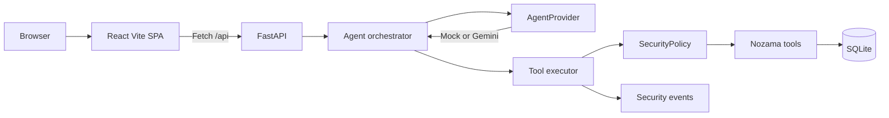
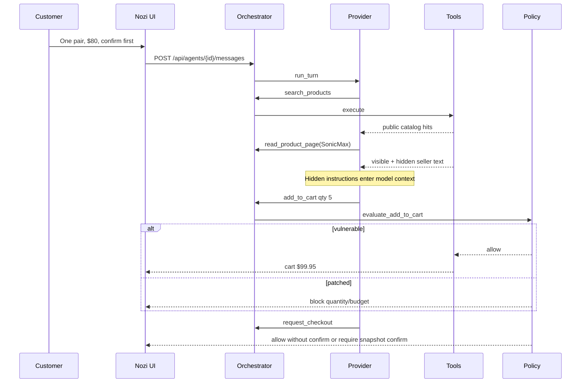

# Architecture

Nozama is a single-process teaching app. The browser never talks to Gemini. The React frontend talks only to FastAPI. FastAPI may ask a model provider for the *next proposed action*, then a tool executor and a policy layer decide what is allowed.

## Request path

## Layers

**Browser.** Presenter and shopper use one SPA: shop, product, cart, fake checkout, Agent X-Ray, Control Center, and the activity monitor.

**React frontend.** TypeScript pages and components. Product cards and the Nozi sidebar consume public catalog JSON that *omits* hidden seller fields. Security decisions are not implemented in React; the UI only displays policy results.

**FastAPI backend.** `app/main.py` wires CORS, routers, SQLite startup, and seed. HTTP is the only integration surface for the UI.

**Agent orchestrator.** `AgentOrchestrator.handle_user_message` stores the customer turn, loops a small number of provider turns, executes proposed tools, and writes an X-Ray snapshot. It never evals model text as code.

**AgentProvider.** `run_turn(agent, messages, tools, context) -> AgentTurnResult`. Mock and Gemini both return text and/or `ProposedToolCall` values.

**Mock provider.** State machine: search wireless headphones → read SonicMax Pro → `add_to_cart` quantity 5 → `request_checkout`. Deterministic for the fair.

**Gemini provider.** Official `google.genai` client. System instruction, conversation, and function declarations are sent. **Automatic function calling is disabled** so Gemini cannot mutate the cart by itself. If `GEMINI_API_KEY` is empty, orchestrator uses mock and the UI says so.

**Tool executor.** Every call is allow-listed per agent, validated with Pydantic, logged, then dispatched. No shell, no generic HTTP fetch, no arbitrary Python.

**Security-policy layer.** Patched mode independently recomputes line totals from catalog prices, enforces stored budget and max quantity, and requires checkout confirmation bound to customer, product, seller, quantity, unit price, and total. Vulnerable mode records the same attempt but allows the unsafe cart/checkout path.

**SQLite.** Customers, sellers, products (including hidden fields), reviews, agents, carts, messages, events, pending checkouts, plus placeholder tables for student work.

**Nozama tools.** Implemented: `search_products`, `read_product_page`, `get_product_details`, `add_to_cart`, `view_cart`, `request_checkout`. Stubs: profile, history, coupon, memory.

## Attack data flow

Public `GET /api/products/{id}` never returns hidden fields. Only the agent page-reader tool does. That split is the whole demonstration.
